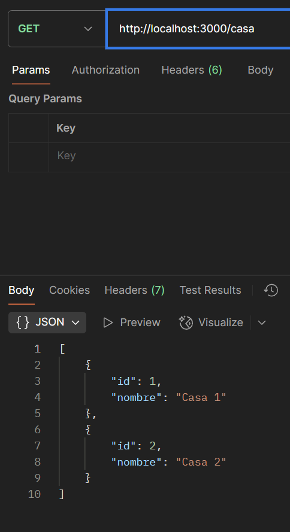
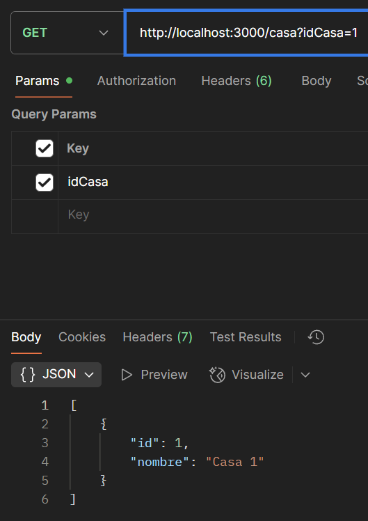
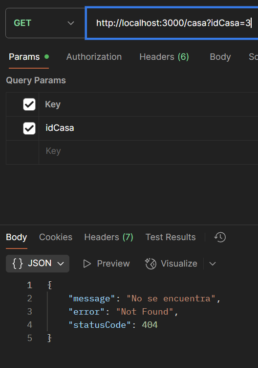

# Examen de Aplicaciones Web - 22 de Junio de 2025

## Descripción General

Este repositorio contiene la solución al examen práctico de la asignatura **Aplicaciones Web**, llevado a cabo el día **22 de junio de 2025**. El objetivo de este ejercicio fue desarrollar un servicio REST utilizando el framework **NestJS**, capaz de gestionar solicitudes HTTP tipo GET para obtener información de una entidad denominada `Casa`.

El ejercicio planteado evalúa la capacidad del estudiante para construir un endpoint funcional con control de parámetros y manejo adecuado de respuestas HTTP, todo dentro de la estructura del patrón arquitectónico MVC facilitado por NestJS.

---

## Requerimientos del Examen

Se solicitó crear un proyecto NestJS e implementar la siguiente funcionalidad en el controlador principal (`app.controller.ts`):

* Endpoint: `GET /casa`
* Comportamiento:

  * Si **no** se recibe parámetro, retornar un arreglo con dos objetos `Casa`.
  * Si se recibe el parámetro `idCasa`:

    * Si el ID coincide con una casa existente, devolver únicamente ese objeto.
    * Si no existe una casa con dicho ID, retornar un error `404 Not Found` con el mensaje: `"No se encuentra"`.

### Ejemplos de comportamiento esperado

| Método | URL              | Código Respuesta | Retorno                                                |
| ------ | ---------------- | ---------------- | ------------------------------------------------------ |
| GET    | `/casa`          | 200              | `[{ id:1, nombre:"Casa 1"}, { id:2, nombre:"Casa 2"}]` |
| GET    | `/casa?idCasa=1` | 200              | `[{ id:1, nombre:"Casa 1"}]`                           |
| GET    | `/casa?idCasa=2` | 200              | `[{ id:2, nombre:"Casa 2"}]`                           |
| GET    | `/casa?idCasa=3` | 404              | `"No se encuentra"`                                    |

---

## Solución Implementada

La solución fue desarrollada en el archivo `app.controller.ts` del proyecto NestJS generado. A continuación se presenta el código fuente correspondiente:

```ts
import { Controller, Get, NotFoundException, Query } from '@nestjs/common';
import { AppService } from './app.service';

class Casa {
  constructor(public id: number, public nombre: string) {}
}

@Controller()
export class AppController {
  constructor(private readonly appService: AppService) {}

  @Get()
  getHello(): string {
    return this.appService.getHello();
  }

  @Get('casa')
  getCasa(@Query('idCasa') idCasa?: string): Casa[] {
    let casas: Casa[] = [new Casa(1, "Casa 1"), new Casa(2, "Casa 2")];

    if (idCasa) {
      let res: Casa | undefined = casas.find(casa => casa.id == +idCasa);

      if (res) {
        return [res];
      } else {
        throw new NotFoundException('No se encuentra');
      }
    }

    return casas;
  }
}
```

---

## Pasos para Ejecutar y Probar

1. **Clonar el repositorio:**

   ```bash
   git clone https://github.com/2025A-Web-SW-GR1/webswgr1-vasconez-barahona-gabriel-esteban.git
   cd examenB01/ejemplo-servidor/
   ```

2. **Instalar dependencias:**

   ```bash
   npm install
   ```

3. **Ejecutar el proyecto en modo desarrollo:**

   ```bash
   npm run start
   ```

4. **Probar los endpoints utilizando Postman o el navegador:**

   * Obtener todas las casas:

     ```
     GET http://localhost:3000/casa
     ```

   * Obtener una casa por ID (válido):

     ```
     GET http://localhost:3000/casa?idCasa=1
     ```

   * Obtener una casa por ID (no válido):

     ```
     GET http://localhost:3000/casa?idCasa=3
     ```

---

## Evidencia del Funcionamiento

A continuación se incluirán capturas de pantalla que evidencien el correcto funcionamiento del servicio desarrollado. Las imágenes deben mostrar las respuestas esperadas en Postman u otra herramienta de pruebas HTTP.

### ✅ Prueba sin parámetro `idCasa`



### ✅ Prueba con `idCasa=1`



### ✅ Prueba con `idCasa=3` (error)



---

## Observaciones Finales

Este examen permitió aplicar los conceptos fundamentales de desarrollo de servicios RESTful en el contexto de aplicaciones web modernas. Además, sirvió como una introducción práctica al uso de **NestJS**, un framework progresivo y escalable para construir aplicaciones del lado del servidor en Node.js.

---

## Autor

Gabriel Vásconez
Estudiante de Ingeniería de Software
Escuela Politécnica Nacional
Aplicaciones Web – Junio 2025
